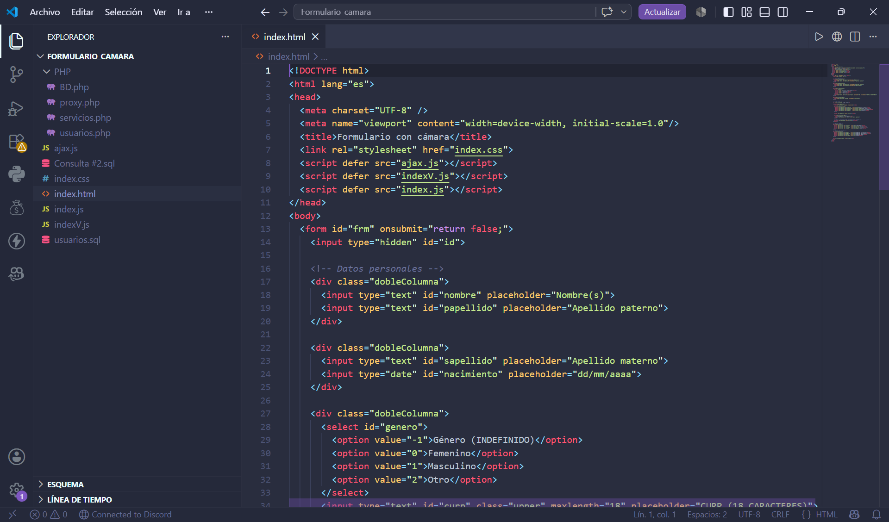
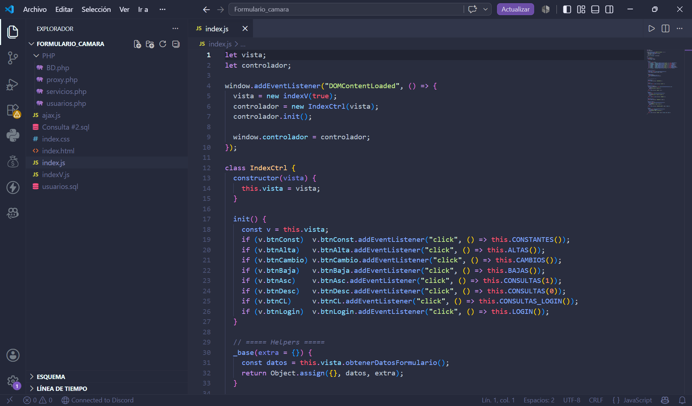
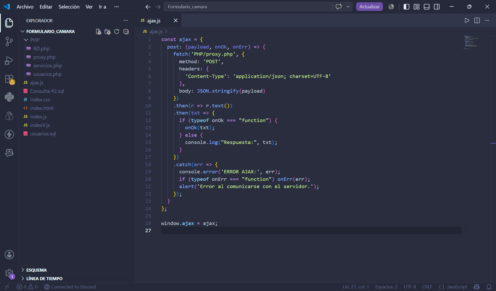
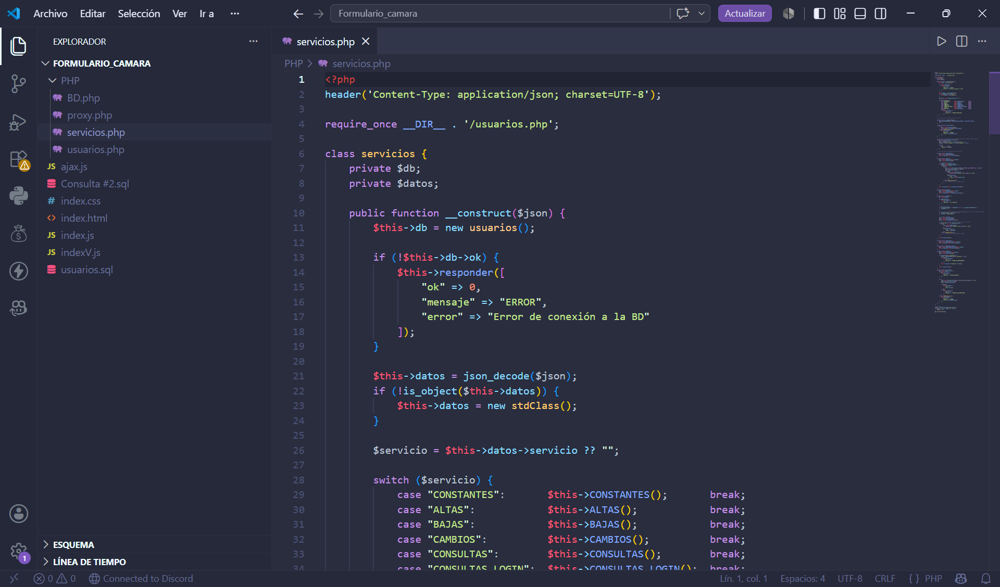
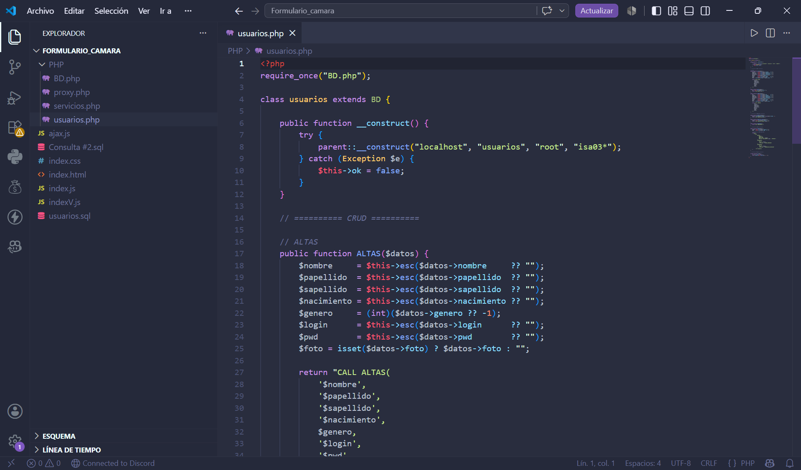
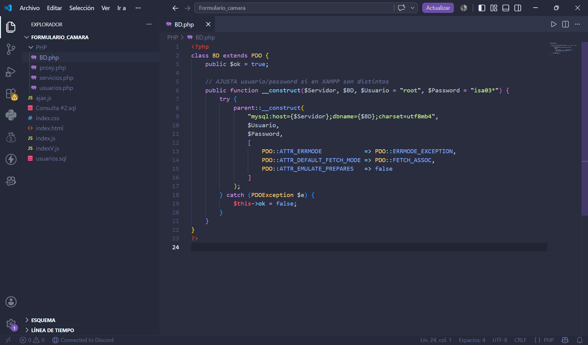
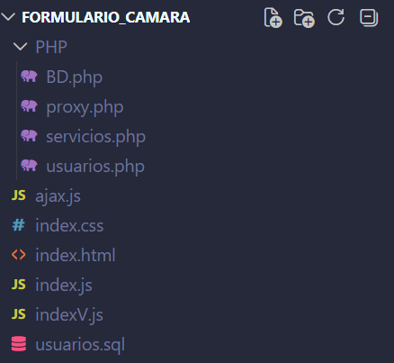

# 📷 Formulario con Cámara

Sistema web desarrollado como práctica académica que permite registrar usuarios mediante un formulario HTML, utilizando la cámara del dispositivo para capturar una fotografía y almacenarla en una base de datos MariaDB.

---

# 📖 Descripción

El proyecto consiste en una aplicación web desarrollada con HTML, CSS, JavaScript, AJAX y PHP que permite realizar operaciones CRUD (Altas, Bajas, Cambios y Consultas) sobre usuarios registrados.

Como característica principal, el sistema hace uso de la API **getUserMedia()** del navegador para acceder a la cámara web, capturar una fotografía y almacenarla codificada en Base64 dentro de la base de datos.

---

# ✨ Características

- Registro de usuarios.
- Captura de fotografía mediante cámara web.
- Vista previa de la fotografía capturada.
- Almacenamiento de imágenes en Base64.
- Consulta de usuarios.
- Consulta ascendente.
- Consulta descendente.
- Inicio de sesión.
- Edición de registros.
- Eliminación de registros.
- Validación de datos.
- Conexión con MariaDB mediante PHP.

---

# 🛠 Tecnologías utilizadas

- HTML5
- CSS3
- JavaScript
- AJAX
- PHP
- MariaDB
- HeidiSQL
- Visual Studio Code
- XAMPP

---

# 📂 Estructura del proyecto

```text
FORMULARIO_CAMARA
│
├── PHP
│   ├── BD.php
│   ├── proxy.php
│   ├── servicios.php
│   └── usuarios.php
│
├── ajax.js
├── index.css
├── index.html
├── index.js
├── indexV.js
│
├── usuarios.sql
└── Consulta #2.sql
```

---

# ⚙ Funcionamiento

1. El usuario llena el formulario.
2. Activa la cámara del dispositivo.
3. Captura una fotografía.
4. La imagen se convierte a formato Base64.
5. Los datos se envían mediante AJAX.
6. PHP procesa la solicitud.
7. MariaDB almacena la información.
8. El sistema permite consultar, modificar y eliminar registros.

---

# 🗄 Base de datos

La base de datos utilizada es **usuarioss**.

Tablas principales:

- constantes
- login
- nombre
- papellido
- sapellido
- nacimiento
- generos
- fotos
- mensajes

---

# 📸 Evidencias del sistema

## Formulario principal


## Captura de fotografía


## Consulta de constantes


## Consulta de usuarios (ascendente)


## Consulta de usuarios (descendente)


## Alta de usuario exitosa


## Login exitoso


---

# 🗄 Evidencias de la base de datos

## Base de datos en HeidiSQL


## Tabla login


## Tabla nombre


## Tabla apellido paterno


## Tabla apellido materno


## Tabla nacimiento


## Tabla géneros


## Tabla fotografías


## Tabla mensajes


## Tabla constantes


---

# 💻 Código fuente

## Formulario HTML



## JavaScript (Cámara)



## AJAX



## Servicios PHP



## Usuarios PHP



## Conexión a la base de datos



## Estructura del proyecto



---

# 🚀 Instalación

1. Instalar **XAMPP**.
2. Iniciar los servicios **Apache** y **MariaDB**.
3. Importar el archivo **usuarios.sql**.
4. Copiar la carpeta **FORMULARIO_CAMARA** dentro de **htdocs**.
5. Abrir el navegador.
6. Ejecutar la siguiente dirección:

```text
http://localhost/Formulario_camara/
```

---

# 👩‍💻 Autora

**Juana Isabel Perez Lopez**

Ingeniería en Sistemas Computacionales

Instituto Tecnológico Superior de Misantla

---

# 📄 Licencia

Proyecto desarrollado con fines académicos.
